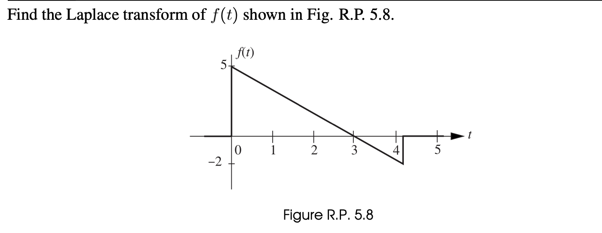

###### Name: Karthik Dani | USN: 1BM22MD022 | Course: Network Analysis | Faculty: Dr. Niranjan K R

## Introduction
This report will carry out computationally finding the Laplace transform of a signal, this task is performed in R with appropriate programming on plotting the curves using `ggplot2`, manually calculating the Laplace transform for visualisation purposes.

## Theory
The Laplace transform is a powerful mathematical tool extensively used in network analysis to analyze and solve linear time-invariant (LTI) systems. In network analysis, it offers a way to simplify differential equations describing circuit behavior into algebraic equations, facilitating their analysis.

- **Definition**: The Laplace transform of a function \( f(t) \) is defined as the integral of the function multiplied by \( e^{-st} \), where \( s \) is a complex variable:

\[
F(s) = \int_0^{\infty} e^{-st} f(t) dt
\]

- **Impulse Response**: The Laplace transform provides a way to compute the impulse response of linear systems, which is crucial for understanding their dynamic behavior.

- **Circuit Analysis**: In network analysis, Laplace transforms are extensively used to analyze electrical circuits. They help in determining voltage and current responses, transient and steady-state behaviors, and frequency-dependent characteristics of circuits.

- **Transform Pairs**: Several common transform pairs exist, which are widely used in network analysis, such as the step function, impulse function, exponential function, and trigonometric functions.

- **Applications**: Laplace transform finds applications in various fields, including control theory, signal processing, communication systems, and electrical engineering, making it a fundamental tool in network analysis and system theory.

## Question



## Solution
The equation of a straight line is $y = mx + c$, where $m$ = slope of the line and $c$ = intercept on
y-axis.

Hence $f(t) = \left(-\frac{5}{3}\right)t + 5$.
When $f(t) = -2$, finding the value of $t$ gives us,

$$-2 =(-\frac{5}{3})t + 5$$

Mathematically,

$$t = 4.2 \text{ seconds}$$


## Load Packages

```{r load-packages}
library(ggplot2)
```

## Define the Function

Let's define the function $f(t)$ in R:

```{r define-function, echo=TRUE, warning=FALSE}
f <- function(t) {
  return((-5/3)*t + 5)
}
```

## Plot the Function

Now, let's plot $f(t)$ over a suitable range. We'll use the range from 0 to 4.2 as given in the question:

```{r plot-function, fig.height=4, fig.width=10, warning=FALSE}
t_values <- seq(0, 4.2, by = 0.01)
f_values <- f(t_values)

df <- data.frame(t = t_values, f = f_values)

ggplot(df, aes(x = t, y = f)) +
  geom_line() +
  geom_segment(aes(x = 4.2, y = -2, xend = 4.2, yend = 0)) + 
  geom_hline(yintercept = 0) +  
  annotate("text", x = 4.2, y = -2, label = "(4.2, -2)", vjust = -1.5, hjust = -0.5) +  
  xlim(0, 4.5) + 
  ylim(-2, 6) + 
  labs(title = "Plot of f(t)", x = "t", y = "f(t)") +
  theme_minimal()
```

The plot above illustrates the behavior of the function $f(t)$.

## Representing sub signals from the given signal
The above signal can be expressed as, $$f(t) = x(t)g(t)$$

$x(t)$ can be represented graphically,

```{r plot-function2, fig.height=4, fig.width=10, warning=FALSE}
t_values <- seq(0, 5, by = 0.01)
f_values <- f(t_values)

df <- data.frame(t = t_values, f = f_values)
ggplot(df, aes(x = t, y = f)) +
  geom_line() +
  geom_hline(yintercept = 0) +  
  annotate("text", x = 4.2, y = -2, label = "(4.2, -2)", vjust = -1.5, hjust = -0.5) +  
  xlim(0, 4.5) + 
  ylim(-2, 6) + 
  labs(title = "Plot of ramp function x(t)", x = "t", y = "x(t)") +
  theme_minimal()
```

Similarly, $g(t)$ can be represented graphically,

```{r plot-function3, fig.height=4, fig.width=10, warning=FALSE}
step_data <- data.frame(t = c(0, 4.2),
                        g = c(1, 1))

# Create the plot
ggplot(step_data, aes(x = t, y = g)) +
  geom_step(direction = "hv") + 
  geom_segment(aes(x = 0, y = 0, xend = 0, yend = 1)) + 
  geom_segment(aes(x = 4.2, y = 0, xend = 4.2, yend = 1)) + 
  xlim(0, 4.2) +  
  ylim(0, 1.0) +  
  labs(title = "Unit Step Function g(t)", x = "t", y = "g(t)") + 
  theme_minimal()
```

## Calculate the Laplace Transform

The Laplace transform of $f(t)$ is given by the formula:

$$ F(s) = \int_0^{\infty} e^{-st} f(t) dt $$

Substituting appropriate values for $x(t)$ and $g(t)$ in. $f(t)$, we get,

$f(t) = [\frac{-5}{3}t + 5] [u(t) - u(t - 4.2)]$

$=\frac{-5}{3}t u(t) + \frac{5}{3}t u(t - 4.2) + 5u(t) - 5u(t - 4.2)$

$=\frac{-5}{3}t u(t) + \frac{5}{3}(t - 4.2 + 4.2)u(t - 4.2) + 5u(t) - 5u(t - 4.2)$

$=\frac{-5}{3}t u(t) + \frac{5}{3}(t - 4.2)u(t - 4.2) + 7u(t - 4.2) + 5u(t) - 5u(t-4.2)$

$=\frac{-5}{3}t u(t) + \frac{5}{3}(t - 4.2)u(t - 4.2) + 2u(t - 4.2) + 5u(t)$\

Hence,

$F(s) = L[f(t)]$
$$= \frac{-5}{3s^2} + \frac{5}{3s^2}e^{-4.2s} + \frac{5}{s}$$
Which simplfies to,
$$=\frac{-5 + 5e^{-4.2s} + 6se^{-4.2s} + 15s}{3s^2}$$
Therefore,

$$L[f(t)] = \frac{-5 + 5e^{-4.2s} + 6se^{-4.2s} + 15s}{3s^2}$$

## Conclusion

In this report, we've discussed the process of finding the Laplace transform of the function $f(t) = \left(-\frac{5}{3}\right)t + 5$. We've plotted the function and outlined the manual calculation process for finding its Laplace transform. Further numerical or symbolic computations can be performed to obtain $F(s)$ for specific values of $s$ if needed.

## Acknowledgement

I would like to express my sincere gratitude to Professor Dr. Niranjan K R sir for granting me permission to carry out this report on Laplace transform for network analysis. His guidance and support have been invaluable throughout the process, and I am deeply thankful for the opportunity to work on this AAT under his supervision.
